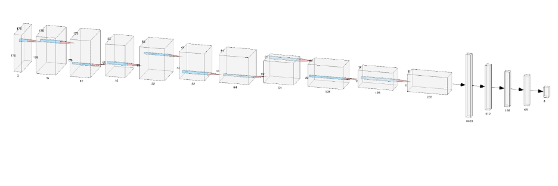

# CNN_Identify-AlzheimersDisease-in-MRI
This is group project while I'm in Duke MQM Graduate program.

We developed a Convolutional Neural Network (CNN) model to classify MRI images into different stages of Alzheimer's Disease

CNNs are particularly adept at identifying spatial and temporal features in images, a critical aspect of medical image analysis like MRI scans. They excel in learning hierarchical feature representations, meaning in the context of MRI images, they can discern complex structures relevant to Alzheimer's Disease, starting from basic edges and textures in the initial layers to more intricate patterns in deeper layers.

Our CNN model architecture is designed to progressively extract more complex features from the input images. Here's an overview of the model structure:
  
- Initial Convolutional Layers: We start with two convolutional layers (conv2d_10 and conv2d_11) with 16 filters each. These layers are designed to capture basic features like edges and textures.
- Max Pooling: A max pooling layer (max_pooling2d_5) follows to reduce the spatial dimensions, enhancing the model's ability to focus on important features and reduce computational load.
- Sequential Convolutional Blocks: We have three sequential blocks, each consisting of a convolutional layer followed by a ReLU activation and max pooling. These blocks (with 32, 64, and 128 filters, respectively) are critical for learning increasingly complex features.
- Dropout Layers: Two dropout layers (dropout_5 and dropout_6) with a dropout rate of 0.5 are included to prevent overfitting by randomly dropping units during training. - Flattening and Dense Layers: After flattening the output of the last convolutional block, we have a series of dense layers to perform classification. The model culminates in a dense layer (dense_7) with four units, corresponding to the four stages of Alzheimer's Disease.

We evetually achieved a test accuracy of 67.47%.
